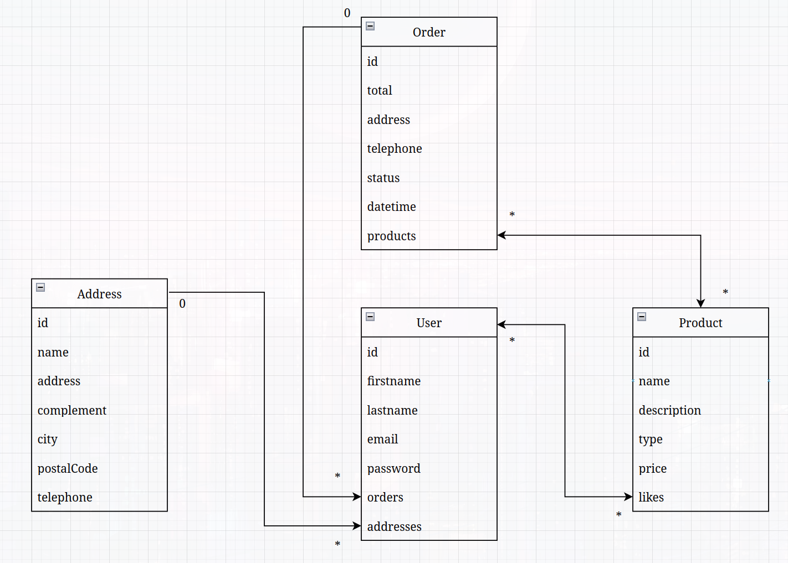

# MCD

## Introduction

Le MCD peut être représenté sous différentes formes, selon la méthode et les outils utilisés. Les trois principales représentations du MCD sont le diagramme entité-association (ou diagramme ER), le diagramme de classes et le diagramme de flux de données (DFD)  
Dans notre cas, je conseille le diagramme de classes, car il va te servir pour créer tes modèles dans le code de ton application futur. Tu auras juste à te baser sur ton MCD pour créer tes classes, pratique non ? :)

## Résumé du besoin

Site e-commerce de mugs, un utilisateur peut ajouter une ou plusieurs adresses de livraison, il peut "like" un ou plusieurs produits, il peut aussi passer une ou plusieurs commandes de produit(s).

## Règles de ton MCD

- Une adresse apartient à 1 utilisateur
- Un utilisateur peut avoir 0..* adresse(s)
- Un utilisateur peut passer 0..* commande(s)
- Un uitlisateur peut "like" 0..* produit(s)
- Une commande est passée par 1 utilisateur
- Une commande peut contenir 1..* produit(s)
- Un produit peut être dans 0..* commande(s)
- Un produit peut être "like" par 0..* utilisateur(s)

## Mes observations

Tes relations entre tes entités sont bonnes. Voici des commentaires :

- La relation entre ADDRESS et USER : Tu as un 0..* car pas de nécessité d'avoir une adresse tant que l'utilisateur ne passe pas de commande. Par contre, il ne faudra pas oublier de demander de séléctionner ou d'ajouter une adresse lors d'un passage d'une commande.
- Dans ton entité PRODUCT tu as un attribut "mug_type" mais imagine ton site commence à vendre des bols dans le futur...Autant nommer cet attribut "type", c'est plus générique :)
- Comment gères-tu tes stocks ? Si c'est "amount" dans ton entité PRODUCT, ce n'est pas très clair, je conseille de renommer en "stock" ou "stock_quantity". Plus de doutes comme ça :)
- Ajouter le prénom et le nom d'un utilisateur, cela peut-être pratique pour l'ajouter en tant que destinataire lors d'une commande
- Il faut ajouter le prix (hors taxes) d'un produit. "price" ou "price_wt" (without taxes) dans ton entité PRODUCT par exemple.
- On peut ajouter un complément d'adresse dans ADDRESS
- On peut aussi ajouter un nom d'adresse, exemple ("maison", "travail", etc.). Cela va permettre de faciliter le choix de l'adresse lors de la commande.
- Dans ton entité ORDER :
    - On peut ajouter la date, c'est toujours utile pour des raisons de comptabilité et facture
    - Ton entité ORDER n'a pas de lien avec "ADDRESS" donc on ne peut pas vraiment savoir ou faire la livraison...Par contre, mettre une relation entre ORDER et ADDRESS n'est pas bon non plus, car imagine tu passes une commande et ensuite tu modifies ton adresse. On souhaite "figer" l'adresse une fois la commande validée et payée. Nous sommes donc obligés d'ajouter les attributs address, city, postal_code dans ton entité ORDER (ou un champ texte "address", au choix).
    - On peut ajouter un numéro de téléphone aussi, dans ADDRESS et dans ORDER

N'hésite pas à te projeter, de te mettre à la place d'un livreur ou d'un comptable par exemple, de quoi ils ont besoin ?  
C'est comme ça que j'ai pu ajouter le complément d'adresse, le numéro de téléphone pour le livreur et la date de la commande pour la comptabilité. 

## Ma proposition

Voici mon MCD (Diagramme de classes) (réalisé sur https://www.draw.io/).  
Tu peux voir que j'ai ajouté des attributs sur les entités et j'ai fait le choix de mettre qu'un seul attribut "address" dans l'entité "Order" pour simplifier. On part aussi du principe que l'adresse de livraison est la même que l'adresse de facturation.

Les relations 0..* sont donc des relations "OneToMany", vu que c'est un diagramme de classes, il faut résonner en objet et non en base de données. C'est pour cela que j'ai ajouté "orders" et "addresses" dans l'entité "User", ce sont des tableaux. 

Les relations \*..\* sont des "ManyToMany" : 

- Entre Order et Product, j'ai décidé de stocker les produits dans Order (products), car dans mon code je vais souvent avoir besoin de récupérer la liste des produits d'une commande, alors que l'inverse non (récupérer les commandes d'un produit)
- Entre User et Product, ce sont les likes, je ne vais pas avoir besoin de récupérer les produits qu'un utilisateur à aimer, par contre, sur un produit, le simple fait de faire le total du tableau "likes" va permettre d'affichier le nombre de like du produit (sur la page produit par exemple)

NB : Mon schéma est "simpliste", je n'ai pas mis les portées des attributs ni les méthodes. Tous mes attributs sont en portée "private" et chaque attribut a une méthode "getter" et une méthode "setter".

## Conclusion

Il n'y a pas qu'un seul schéma de bon, il en existe plein, tout dépend de tes choix techniques et des besoins fonctionnels (du métier).  
Dans tous les cas, un schéma n'est pas figé, il peut évoluer en fonction de ce dont tu te rends compte dans ton code.  
La cible reste tout de même de faire un schéma qui change le moins possible, c'est donc important de bien le concevoir dès le début pour éviter les gros virages technique.

Encore une fois, n'hésite pas si tu as des questions ou des remarques.